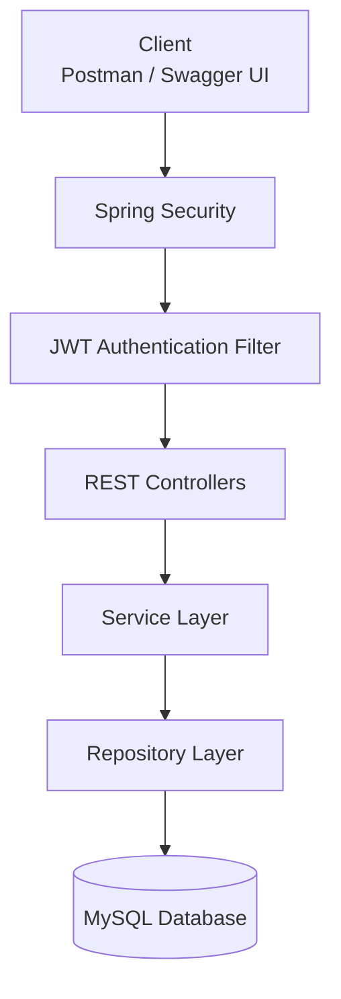
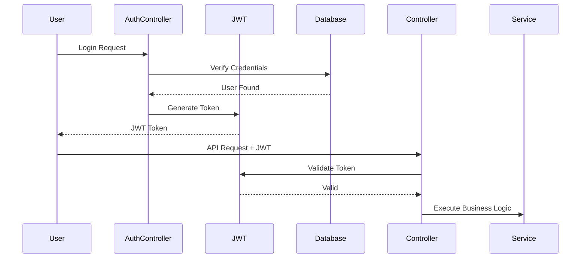
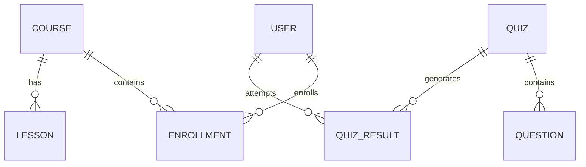

# 🚀 Zenith – E-Learning Platform

<p align="center">


</p>

<p align="center">

### 📚 Secure REST API Based E-Learning Platform built using Spring Boot

*A scalable backend application that enables students to learn through courses, lessons, and quizzes while providing administrators with complete management capabilities.*

</p>

---

# 📖 About The Project

**Zenith** is a backend-focused **E-Learning Platform** developed using **Java** and **Spring Boot** following a layered architecture.

The application provides a secure learning environment where students can register, enroll in courses, access lessons, attempt quizzes, and track their quiz performance. Administrators have complete control over managing courses, lessons, quizzes, questions, enrollments, and dashboard statistics.

The project emphasizes **clean architecture**, **secure authentication**, **RESTful API design**, and **best practices** using Spring Boot.

> **Note:** This project currently focuses on the backend implementation. Frontend integration is planned for a future release.

---

# ✨ Key Features

### 🔐 Authentication & Security

- JWT Authentication
- Secure Login & Registration
- Role-Based Authorization (Admin & Student)
- Protected REST APIs
- Spring Security Integration

---

### 📚 Course Management

- Create Course
- Update Course
- Delete Course
- Get All Courses
- Get Course By ID

---

### 🎥 Lesson Management

- Add Lessons to Courses
- Update Lessons
- Delete Lessons
- View Lessons by Course

---

### 🎓 Enrollment Module

- Student Course Enrollment
- View Enrolled Courses
- Admin Enrollment Management

---

### 📝 Quiz Module

- Create Quiz
- Difficulty Levels (Easy / Medium / Hard)
- Add Questions
- Bulk Question Upload
- Update Questions
- Delete Questions

---

### 📊 Quiz Result Module

- Submit Quiz
- Automatic Score Calculation
- Store Quiz History
- View Previous Results

---

### 📈 Admin Dashboard

- Total Users
- Total Courses
- Total Enrollments
- Total Quizzes

---

# 🛠️ Tech Stack

| Category | Technology |
|----------|------------|
| Language | Java 17 |
| Framework | Spring Boot |
| Security | Spring Security + JWT |
| ORM | Hibernate |
| Persistence | Spring Data JPA |
| Database | MySQL |
| Build Tool | Maven |
| Documentation | Swagger (OpenAPI) |
| Boilerplate Reduction | Lombok |
| Validation | Jakarta Validation |

---

# 🎯 Project Objectives

- Build a secure RESTful backend application.
- Implement JWT-based authentication and authorization.
- Follow a clean layered architecture.
- Practice Spring Boot best practices.
- Design scalable APIs for real-world applications.
- Improve backend development skills using Java and Spring technologies.

---
# 🏗️ System Architecture

Zenith follows a **Layered Architecture**, where each layer has a dedicated responsibility. This separation improves maintainability, scalability, and code readability.



---

## 🔄 Request Flow

```text
                Client
                  │
                  ▼
        Spring Security
                  │
                  ▼
      JWT Authentication Filter
                  │
                  ▼
         REST Controller Layer
                  │
                  ▼
           Service Layer
          (Business Logic)
                  │
                  ▼
        Repository Layer
         (Spring Data JPA)
                  │
                  ▼
            MySQL Database
```

---

# 🏛️ Layered Architecture

## 📌 Controller Layer

The Controller layer exposes REST APIs and handles incoming HTTP requests. It validates request data and delegates business operations to the Service layer.

**Responsibilities**

- Handle HTTP Requests
- Return HTTP Responses
- Validate Request Body
- Call Service Methods

---

## 📌 Service Layer

The Service layer contains the complete business logic of the application. It processes requests, performs validations, communicates with repositories, and prepares response DTOs.

**Responsibilities**

- Business Logic
- DTO Mapping
- Data Validation
- Score Calculation
- Enrollment Logic
- Authentication Logic

---

## 📌 Repository Layer

The Repository layer communicates directly with the database using Spring Data JPA.

**Responsibilities**

- CRUD Operations
- Database Queries
- Entity Persistence
- Data Retrieval

---

## 📌 Database Layer

The application uses **MySQL** as the relational database.

It stores:

- Users
- Courses
- Lessons
- Enrollments
- Quizzes
- Questions
- Quiz Results

---

# 🔐 Authentication Flow

The application uses **JWT (JSON Web Token)** for authentication.



---

# 🗄️ Database Relationship



---

# 📦 Project Structure

```text
Zenith-E-Learning-Platform
│
├── src
│   ├── main
│   │
│   ├── java
│   │   └── com.avinash.book_network
│   │
│   │       ├── config
│   │       ├── controller
│   │       ├── dto
│   │       ├── entity
│   │       ├── exception
│   │       ├── repository
│   │       ├── security
│   │       ├── service
│   │       └── BookNetworkApplication.java
│   │
│   └── resources
│       ├── application.properties
│       └── static
│
├── pom.xml
└── README.md
```

---

# 🧩 Design Principles

✔ Layered Architecture

✔ RESTful API Design

✔ DTO Pattern

✔ Repository Pattern

✔ Role-Based Authorization

✔ JWT Authentication

✔ Separation of Concerns

✔ Clean Code Practices

# 🚀 REST API Modules

The application is divided into multiple modules following a modular backend architecture.

| Module | Description | Status |
|---------|-------------|:------:|
| 🔐 Authentication | User Registration & Login using JWT | ✅ |
| 📚 Course | Create, Update, Delete & View Courses | ✅ |
| 🎥 Lesson | Manage Course Lessons | ✅ |
| 🎓 Enrollment | Student Course Enrollment | ✅ |
| 📝 Quiz | Create & Manage Quizzes | ✅ |
| ❓ Question | CRUD & Bulk Upload Questions | ✅ |
| 📊 Quiz Result | Automatic Evaluation & Result History | ✅ |
| 📈 Dashboard | Platform Statistics | ✅ |

---

# 📡 API Endpoints

## 🔐 Authentication

| Method | Endpoint |
|---------|----------|
| POST | `/auth/register` |
| POST | `/auth/login` |

---

## 📚 Course

| Method | Endpoint |
|---------|----------|
| POST | `/courses/createcourse` |
| GET | `/courses/getAllCourses` |
| GET | `/courses/{id}` |
| PUT | `/courses/{id}` |
| DELETE | `/courses/{id}` |

---

## 🎥 Lesson

| Method | Endpoint |
|---------|----------|
| POST | `/lessons` |
| GET | `/lessons/course/{courseId}` |
| PUT | `/lessons/delete/{lessonId}` |
| DELETE | `/lessons/delete/{id}` |

---

## 🎓 Enrollment

| Method | Endpoint |
|---------|----------|
| POST | `/enrollments/course/{courseId}` |
| GET | `/enrollments/my-courses` |
| GET | `/enrollments` |

---

## 📝 Quiz

| Method | Endpoint |
|---------|----------|
| POST | `/quizzes/create` |
| GET | `/quizzes` |

---

## ❓ Question

| Method | Endpoint |
|---------|----------|
| POST | `/questions/create` |
| POST | `/questions/bulk` |
| GET | `/questions/quiz/{quizId}` |
| PUT | `/questions/{questionId}` |
| DELETE | `/questions/{questionId}` |

---

## 📊 Quiz Result

| Method | Endpoint |
|---------|----------|
| POST | `/quiz-results/submit` |
| GET | `/quiz-results/my-results` |

---

## 📈 Dashboard

| Method | Endpoint |
|---------|----------|
| GET | `/dashboard` |

---

# ⚙️ Installation & Setup

## 1️⃣ Clone the Repository

```bash
git clone https://github.com/avinash2401-dev/Zenith-E-Learning-Platform.git
cd Zenith-E-Learning-Platform
```

---

## 2️⃣ Configure Database

Update your **application.properties**

```properties
spring.datasource.url=jdbc:mysql://localhost:3306/your_database
spring.datasource.username=your_username
spring.datasource.password=your_password
```

---

## 3️⃣ Build the Project

```bash
mvn clean install
```

---

## 4️⃣ Run the Application

```bash
mvn spring-boot:run
```

The application will start on:

```text
http://localhost:8080
```

---

# 📖 API Documentation

Swagger UI is integrated for testing and exploring all REST APIs.

After running the application, visit:

```text
http://localhost:8080/swagger-ui/index.html
```

---

# 📌 Highlights

✔ Secure JWT Authentication

✔ Role-Based Authorization

✔ Layered Architecture

✔ DTO Pattern

✔ Repository Pattern

✔ Clean REST API Design

✔ Global Exception Handling

✔ Request Validation

✔ Swagger Documentation

✔ MySQL Database Integration

---

# 🔮 Future Enhancements

- 🎨 Frontend Integration
- 📜 Certificate Generation
- 📹 Video Streaming Support
- 📊 Student Progress Tracking
- 📧 Email Notifications
- ⭐ Course Rating & Reviews

---

# 👨‍💻 Author

## Avinash Upadhyay

**Java Backend Developer**

- 💼 Passionate about Backend Development using Java & Spring Boot
- 🌱 Currently learning Scalable Backend System Design
- 📫 Open to Internship & Full-Time Opportunities

### Connect with Me

- **GitHub:** https://github.com/avinash2401-dev
- **LinkedIn:** https://www.linkedin.com/in/avinash-upadhyay24/

---

<p align="center">
⭐ If you found this project useful, don't forget to Star this repository!
</p>

---

# 📸 Project Preview

> Frontend integration is currently under development.  
> Screenshots will be added after the frontend is completed.

### Authentication


### Dashboard


### Course Module


### Quiz Module


> **Note:** Create an `assets` folder in the repository root and place your screenshots there after the frontend is ready.

---

# 💡 What I Learned

This project helped me strengthen my understanding of backend development using the Spring ecosystem.

During development, I gained practical experience in:

- Designing RESTful APIs
- Implementing JWT Authentication
- Role-Based Authorization
- Spring Security Configuration
- Layered Architecture
- DTO Pattern
- Entity Relationships using JPA
- Validation & Exception Handling
- Database Design with MySQL
- API Documentation using Swagger
- Building production-style backend applications

---

# 🎯 Project Highlights

- Clean Layered Architecture
- Secure JWT Authentication
- Role-Based Access Control
- Modular REST APIs
- Bulk Question Upload
- Automatic Quiz Evaluation
- Dashboard Statistics
- Well Structured Codebase
- Swagger Integration
- Scalable Backend Design

---

# 🚀 Future Scope

The following features are planned for future releases:

- Responsive Frontend
- Student Progress Tracking
- Video Streaming Support
- Course Completion Certificates
- Email Notifications
- Course Rating & Reviews
- Pagination & Search
- File Upload Support

---

# 🤝 Contributing

Contributions are welcome.

If you would like to improve this project:

1. Fork the repository
2. Create a feature branch

```bash
git checkout -b feature/your-feature
```

3. Commit your changes

```bash
git commit -m "Add your feature"
```

4. Push to your branch

```bash
git push origin feature/your-feature
```

5. Open a Pull Request

---

# 📄 License

This project is licensed under the MIT License.


